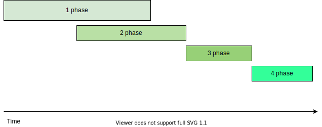

Table of content: 
- [Problem analysis](#problem-analysis)
	- [Existing system overview](#existing-system-overview)
	- [Requirements interpretation](#requirements-interpretation)
	- [Assumptions and constraints](#assumptions-and-constraints)
- [Solution](#solution)
	- [Solution Approach Summary](#solution-approach-summary)
	- [System actors](#system-actors)
	- [Utility tree](#utility-tree)
	- [Quality attributes walk-through](#quality-attributes-walk-through)
- [Views and Perspectives](#views-and-perspectives)
	- [System diagram](#system-diagram)
	- [Data flow diagram](#data-flow-diagram)
	- [Infrastructure diagrams](#infrastructure-diagrams)

- [Migration plan](#migration-plan)

## Problem analysis

### Existing system overview

The existing system in a nutshell is a ticketing system giving possibility for client to raise issues and matching experts to resolve those issues by multiple parameters (location, expertise, availability etc). It has administrators for user and content management as well as managers to monitor and analyze operations via reports.

The system has some custom applications for all parties: 
 - ticket entry system for clients (web and/or mobile app) 
 - ticket entry system for call center staff (web app) 
 - experts app for ticket handling and knowledge base read-write access (mobile app)
 - admin console for user and content management, ticket read only search (web app) 
 - managers app for reports running

### Requirements interpretation

Here is problem statement: 

> *Things have not been good with the Sysops Squad lately. The current trouble ticket system is a large monolithic application that was developed many years
ago. Customers are complaining that consultants are never showing up due to lost tickets, and often times the wrong consultant shows up to fix something
they know nothing about. Customers and call-center staff have been complaining that the system is not always available for web-based or call-based problem
ticket entry. Change is difficult and risky in this large monolith - whenever a change is made, it takes too long and something else usually breaks. Due to
reliability issues, the monolithic system frequently “freezes up” or crashes - they think it’s mostly due a spike in usage and the number of customers using the
system. If something isn’t done soon, Penultimate Electronics will be forced to abandon this very lucrative business line and fire all of the experts (including
you, the architect).*

Giving statement above it is clear that due to growth or seasonal spikes in customer activities company struggles to deliver its core promises and is on the verge of complete shutdown of business operations and exit. 

Major issues identified by quick analysis are following in an descending order of importance:

 - Inability of existing technical infrastructure to accommodate current load and things getting worse during spikes of customer activity, resulting in low customer satisfaction.
 - Failing business processes, e.g. inadequate matchmaking of skills to problems leading to wasted time, resources and business opportunities.
 - It is hard to identify and eliminate system bugs due to lack of overall system transparency and poor ticket lifecycle management.

### Assumptions and constraints

 It is clear that time is critical.
 
 We assume that budget for change is not bounded meaning some reasonable limits.
 

## Solution

### Solution Approach Summary

To tackle this problem we decided to follow further steps: 

   - Identify quality attributes using existing system description and problem statement.
   - Analyze architecture significant requirements (derived from functional, non-functional requirements and constraints) using Utility tree and rate them.
   
After analysis we made decision to:
   - Make amendments in ticket processing flow introducing Customer success manager role.
   - Redesign existing monolith application into service-based system providing desired system views in later chapter.
   - Provide migration plan using phased approach starting from implementation of most viable features and extending system capabilities gradually.

### System actors

Current system inherited most of actors from previous system like customers, call center agents, managers, admins and experts.
But admin responsibilities slightly changed in following way: 
   - no more ticket access, only registration of experts, call center agents, managers and admins in system. Moreover we would like to propose self registration for experts with automatic experience evaluation and probation period (ADR 2)

New role Customer success manager is in charge of tickets flow success guarantee - this role have access to special console providing monitoring of tickets state, alerts for broken tickets and ways to relaunch ticket inthe flow or manually assign it.

### Utility tree

### Quality attributes walk-through

## Views and Perspectives

### System diagram

#### Primary presentation

#### Element catalog

   - Ticket Onboarding UI - web/mobile app where client or call center representative can login and create ticket.
     Chat bot - built-in app for simple solutions proposal based on client answers. Helps save time, resources and satisfy customers.

   - Ticket Status UI - web/mobile app where client or call center representative can login and view ticket/add comments.

   - Front Service - API service in charge of receival user requests, validating, preprocessing (e.g. ensure auth) them and forwarding to underlying services.

   - Auth service - service providing auth layer for all incoming requests.

   - Chat bot service - backend service providing questions, processing answers to find solution. Uses ML algorythms. Here just for reference, to be explained in details here: [ADR 1](doc/adr/0001-chat-bot-service.md).

   - Ticket CRUD service - regular service for create, read, update, delete(soft) operations with tickets.

   - Matching service - service for automatic matching incoming tickets to most suitable experts.

   - Notification Service - Service for sending alerts and notifications.

   - Expert Mobile App - Used by experts to receive ticket assignment notifications and further ticket status updates, comments and knowledge base access. 

   - Knowledge Base Service - used for experts lookup of solutions and filling knowledge base. Uses gamification techniques - giving bonus points for articles.

   - Discrepancy service - looks for difference among created, assigned, resolved tickets and if something wrong found sends message to Healing service to try resolve issue.

   - Healing service - set of rules how to fix ticket reported by Discrepancy service, if not fixed - send alert to manager via Notification service.

   - Manager UI - web/mobile app to run reports, receive alerts about problematic tickets, tools for manual ticket fix. All ticket actions audited. 

   - Reporting service - used to retrieve report data and generate reports.

   - Data Preparation service - used to prepare data for data warehouse.
  
   - Client subscription UI - web/mobile app to let clients (customers) to subscribe on support plan and provide payment option.
  
   - Subscription Service - business logic for clients registration and subscription details.
  
   - Experts self-registration UI - web app which can register experts automatically, requesting expertise confirming docs and having human agent for resolution of corner cases for experts failed to be registered automatically.

   - Experts self-registration service - service walking experts through self-registration and integrated with some 3d party services  to confirm uploaded documents validity.
  
   - Expert Availability Service - experts may update their current state like new skills, vacation etc to provide better matching.
  
   - Admin console - web app for admins to register admins, managers and other internal staff, give them corresponding permissions and content management system. 

   - Admin service - service powering admin console.
    
   - Customer Success Management Console - web/mobile app to receive alerts about tickets out of normal processing, contact customers, manually assign experts and reset ticket flows.

#### Context diagram

#### Variability guide

#### Rationale

Current system is evolution of monolith to service-based architecture with services decomposed and communicating via intermediary message queues. This gives effect of maintainability, evolvabilty, performance improvements.

### Data flow diagram

*NOTE: Banking and discrepancy service are not included for the sake of simplicity*

### Infrastructure diagrams

Decision was taken to deploy services in AWS to save time and having reasonable compute, network and storage capacity.

*NOTE: This is not exhaustive services deployment guide, just basic idea, AWS VPC, AWS IAM and some subsystems omitted but ideally need to be added*

#### Primary presentation

#### Element catalog

#### Context diagram

#### Variability guide

Other public clouds still have not reached AWS maturity so they not an option at the moment.
If customer company has significant compute, network and storage capacities then hybrid or on-premises options may be considered still looking more time consuming and less efficient for medium-sized business.

#### Rationale

Cloud based deployment gives lots of possibilities to scale, monitor, update and orchestrate system without extra investments into super qualified development team or hardware update, providing reasonable time to market timeline.

## Migration plan

To be sure that system meets functional requirements, quality attributes and time constraints it is advised to implement described above system in several phases.

1 Phase

This phase main goal to provide clients new interface and make A-B testing. 
Data about experts to be imported from old system.
Only newly registered customers redirected to this new system.

Services to be implemented: Ticket Onboarding UI, Ticket Status UI, Front Service, Auth service, Ticket CRUD service, Matching service, Notification Service, Expert Mobile App, Knowledge Base Service, Client subscription UI, Subscription Service.

2 Phase

This phase main goal to provide control plain. ( may be started in parallel when some parts of 1 phase done).
After this phase is done it is good time to extend A-B testing audience.

Services to be implemented: Manager UI, Reporting service, Data Preparation service, Admin console, Admin service. 

3 Phase

This phase main goal to provide some advanced techniques to improve system.

Services to be implemented: Chat bot UI, Chat bot service, Discrepancy service, Healing service, Experts self-registration UI, Experts self-registration service, Expert Availability Service, Customer Success Management Console.

4 Phase

After previous phases implemented, tested, bugs fixed old system should be marked obsolete and all public IPs be deleted from DNS. All data about users and opened tickets transferred to the new system and after some grace period old system to be shut down.

